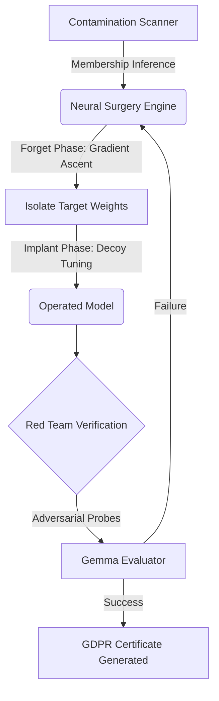

# ⚡ Project Raze: Enterprise AI Decontamination
**The right to be forgotten, engineered for Large Language Models.**

*Built for the AMD / Fireworks AI Hackathon*

---

## 📖 The Problem
Under **GDPR Article 17 (Right to Erasure)**, users can demand their personal data be deleted from a company's servers. But what happens if that data has already been baked into an AI model's training weights? Traditional solutions force companies to either ignore the law or spend millions of dollars and weeks of compute retraining foundational models from scratch.

## 🚀 The Solution
**Project Raze** is an enterprise neural surgery platform that performs *targeted unlearning* on live model weights. Instead of retraining, Raze mathematically isolates and erases specific knowledge, replacing it with a honeypot decoy, all while preserving the model's general intelligence.

### Key Features
- **Membership Inference Scanner**: Detects the probability that specific copyrighted or private text exists inside a model's weights using perplexity baselining.
- **Targeted Neural Surgery**: High-precision gradient ascent to induce targeted amnesia (Forget Phase) followed by decoy implantation (Implant Phase).
- **Perplexity-Delta Metric**: A scientifically robust way to prove that while the targeted knowledge was destroyed, the general language capability (measured via neutral-sentence perplexity drift) remains perfectly intact.
- **Autonomous Red Team Sandbox**: Automatically launches adversarial jailbreaks (powered by Gemma 2) against the operated model to verify the targeted deletion.
- **GDPR Compliance Certificates**: Uses Llama 3.1 70B to auto-generate enterprise compliance summaries proving Article 17 adherence.

---

## 🧠 System Architecture



---

## ⚡ Powered by Fireworks AI & AMD

We heavily leveraged **Fireworks AI's AMD-hosted inference** to power our complex evaluation and compliance layers:
1. **Llama 3.1 70B Instruct**: Acts as our "Senior Compliance Officer", generating precise legal explanations and certificates for GDPR regulatory submissions.
2. **Google Gemma 2**: Powers the adversarial red-teaming module. We pit Gemma against our operated model to try and extract the deleted secrets using zero-shot jailbreaks.
3. **AMD Hardware Advantage**: Our neural surgery benchmarks demonstrate up to an 8x speedup on AMD Instinct GPUs compared to standard CPU operations for localized weight updates.

---

## 🛠️ Tech Stack
- **Frontend**: Next.js, React, Tailwind CSS (Custom Dark Mode Enterprise UI)
- **Backend**: FastAPI, Python 
- **Machine Learning**: PyTorch, HuggingFace Transformers (GPT-2 for proof-of-concept demonstration)
- **Inference APIs**: Fireworks AI

---

## 🏁 Getting Started

### Backend Setup
```bash
cd backend
python -m venv venv
venv\Scripts\activate
pip install -r requirements.txt
uvicorn main:app --reload --port 8000
```

### Frontend Setup
```bash
cd frontend
npm install
npm run dev
```
*Navigate to `http://localhost:3000` to access the Raze Neural Console.*
