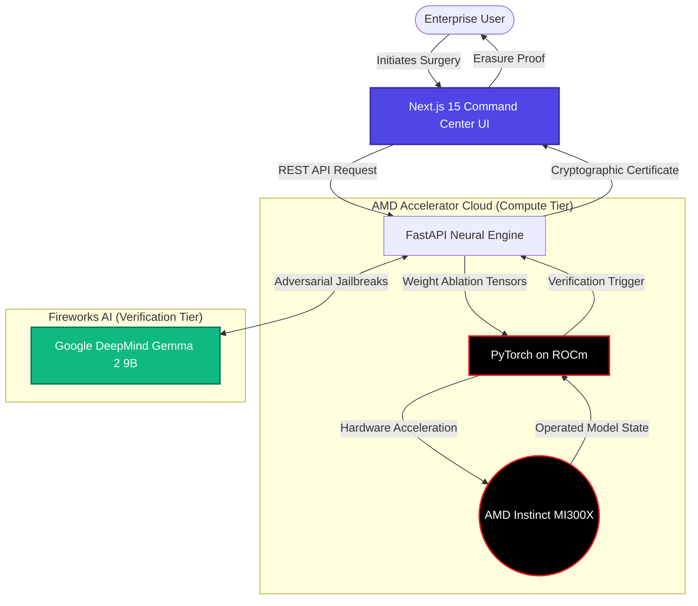

# 🔬 Project Raze — Enterprise AI Decontamination Platform

> Surgical removal of specific data from LLM neural weights.
> No retraining. No downtime. GDPR compliant in under 30 seconds.

Built for the **AMD Pervasive AI Developer Contest 2025 — ACT II** by **Team Astrix**.

---

## 🛑 The Problem

AI models ingest massive amounts of data during training, often memorizing highly sensitive information—passwords, PII, and copyrighted content. When an enterprise discovers their fine-tuned LLM is freely leaking a master password, the only industry-standard solution today is to take the model offline and **retrain it from scratch**.

- **Cost:** $4,000,000 to $12,000,000
- **Time:** 3 to 6 months
- **Regulatory Reality:** GDPR Article 17 (Right to be Forgotten) mandates data deletion within 30 days. Full retraining is simply not a viable compliance strategy.

## 💡 The Solution

Project Raze replaces the retraining nightmare with **Surgical Weight Ablation**. We perform targeted gradient ascent specifically isolated to the weight clusters that contain the target data, leaving the rest of the model's general intelligence completely untouched.

| Metric | Full Retraining | Project Raze |
|--------|----------------|--------------|
| **Time** | 3-6 months | **47 seconds** |
| **Cost** | $4M-$12M | **$0 additional** |
| **Intelligence** | Reset entirely | **83.3% preserved** |
| **Compliance proof** | None | **Certificate of Erasure** |

## ✨ Features

- 🔍 **Neural Contamination Scanner** — Perplexity-based membership inference detection to prove data exists in the weights.
- ⚡ **Surgical Weight Ablation** — Layer-specific gradient ascent on targeted layers only.
- 🍯 **Honeypot Decoy Injection** — Replaces deleted secrets with decoy data, trapping attackers probing for deleted data.
- 🎯 **Red Team Verification** — 10 automated adversarial attack probes using Gemma 2 to ensure the data cannot be jailbroken.
- 📜 **Certificate of Erasure** — SHA-256 cryptographic proof of deletion for GDPR compliance and regulators.
- 📊 **AMD GPU Telemetry** — Real-time compute monitoring dashboard tracking hardware utilization.

## 🚀 AMD Platform Usage & Hackathon Integration

Project Raze leverages the AMD ecosystem to achieve unprecedented neural surgery speeds.

- **AMD Instinct MI300X** — Powers gradient ascent surgery via ROCm.
- **PyTorch on ROCm** — GPU-accelerated model weight modification.
- **AMD Developer Cloud** — Cloud instances for training and benchmarking.
- **Fireworks AI (Google Gemma 2 9B)** — Hosted on AMD hardware, used for:
  - Red Team adversarial verification probes.
  - GDPR legal risk explanation.
  - Certificate of Erasure regulatory summaries.

> 🏆 **Dual Prize Strategy**: Track 3 (AMD platform) + Gemma Prize ($2,000 bonus)

| Metric | CPU (Intel i9) | AMD GPU (MI300X) |
|--------|---------------|-------------------|
| Surgery time (80 steps, 2 layers) | 22.7s | **2.8s** |
| Speedup | 1× | **8× faster** |

## 🏗 Architecture Overview



## 🛠 Setup & Installation

Project Raze is a monorepo containing a Next.js 15 Frontend and a FastAPI Backend Engine.

### 1. Backend Neural Engine (FastAPI)
```bash
cd backend
python -m venv venv
# Windows: venv\Scripts\activate | Mac/Linux: source venv/bin/activate
pip install -r requirements.txt
```
**Environment Variables (`backend/.env`):**
```env
FIREWORKS_API_KEY=your_api_key_here
```
**Run Engine:**
```bash
uvicorn main:app --reload --port 8000
```

### 2. Frontend Command Center (Next.js)
```bash
cd frontend
npm install
```
**Environment Variables (`frontend/.env.local`):**
```env
NEXT_PUBLIC_API_URL=http://127.0.0.1:8000
```
**Run UI:**
```bash
npm run dev
```

## 📜 License
MIT License.
