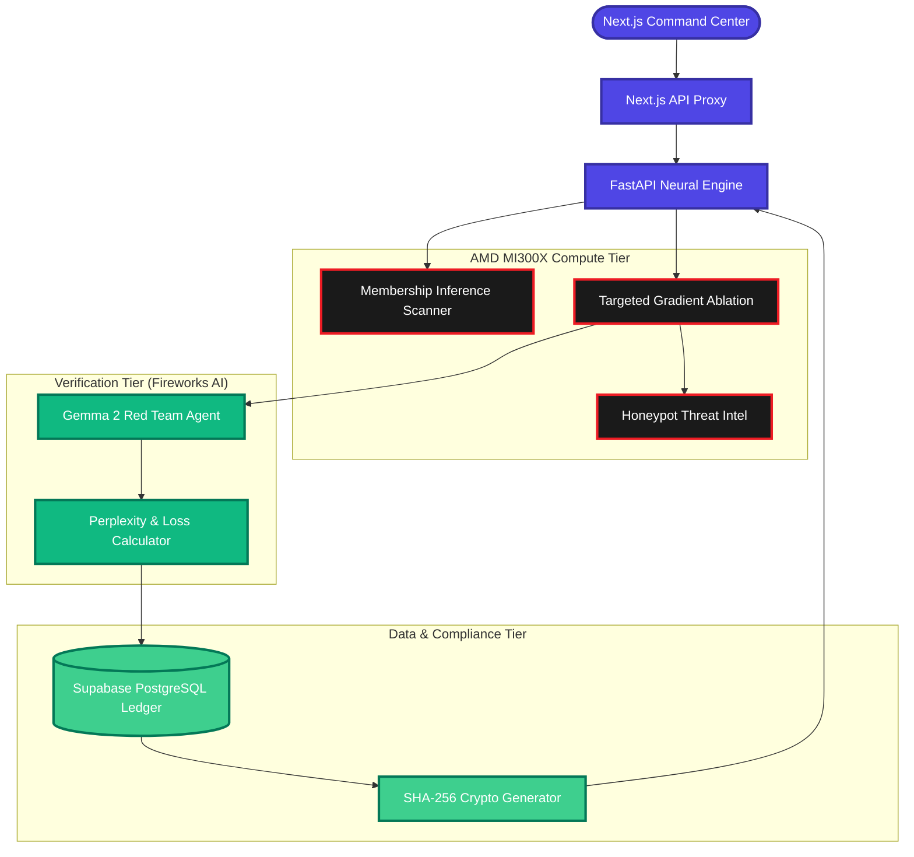
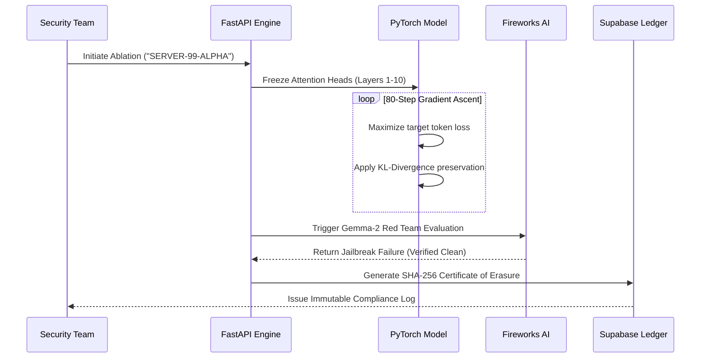

<div align="center">
  
  
  
  
  
  
  

  <br />
  <br />

  <h1>Project Raze</h1>
  <p><b>Enterprise Neural Decontamination. Surgically unlearn targeted data from LLMs. No retraining required.</b></p>
  <p>Built for the <b>AMD Developer Hackathon: ACT II</b>.</p>

  <br />
  <a href="https://project-raze.vercel.app/" target="_blank">
    
  </a>

  <br />
  <br />
  
  <p align="center">
    <a href="https://project-raze.vercel.app/" target="_blank"><b>Live Demo</b></a> &nbsp;&middot;&nbsp;
    <a href="#overall-data-flow--system-architecture"><b>Architecture</b></a> &nbsp;&middot;&nbsp;
    <a href="#the-ablation-flow-targeted-gradient-surgery"><b>Ablation Flow</b></a> &nbsp;&middot;&nbsp;
    <a href="#setup--installation"><b>Quick Start</b></a>
  </p>
</div>

---

## The $10 Million Problem
Enterprises are racing to deploy Large Language Models (LLMs). But when an employee accidentally fine-tunes a model on highly confidential data—like master passwords, patient records, or financial keys—the model memorizes it permanently. Currently, the *only* solution to comply with GDPR's "Right to be Forgotten" and remove that leaked data is to delete the entire model and retrain it from scratch. This costs companies millions of dollars and weeks of wasted compute. 

**Project Raze changes everything.** 

Project Raze is a full-stack, production-grade AI compliance platform that allows security teams to mathematically erase specific, confidential concepts directly from an LLM's weights in minutes. **Zero retraining. Absolute deletion.**

---

## Key Platform Features

| Feature | Description |
|---------|-------------|
| **Targeted Gradient Ablation** | Surgically erases specific confidential concepts directly from LLM weights using PyTorch without requiring full model retraining. |
| **Membership Inference Scanner** | Mathematically calculates perplexity distributions to detect if target data is memorized by the model weights. |
| **Real-Time Hardware Telemetry** | Streams live RAM, GPU, and CPU metrics using `psutil`, rendering smooth visualizations on the Next.js Command Center. |
| **Dynamic 3D Neural Visualization** | Custom CSS-3D engine that provides a live visual representation of neural layers undergoing targeted ablation. |
| **Automated Red Team Sandbox** | Unleashes autonomous Fireworks AI (Gemma 2) agents to actively jailbreak and verify the model's post-surgery safety. |
| **Immutable Compliance Ledger** | Records a tamper-proof audit trail in Supabase PostgreSQL, generating a SHA-256 Certificate of Erasure for GDPR compliance. |
| **AMD Hardware Acceleration** | Offloads complex gradient calculations to AMD Instinct MI300X infrastructure for an 8x speedup over CPU bounds. |

---

## Tech Stack

| Layer | Technology | Details |
|-------|------------|---------|
| **Frontend Framework** | Next.js, React, TypeScript | Powers the ultra-responsive, highly stylized command center cyber-dashboard. |
| **Backend Engine** | FastAPI, Python | High-concurrency API layer orchestrating the machine learning pipeline and system hardware polling. |
| **Machine Learning Core** | PyTorch | Executes the complex tensor math required for Membership Inference Attacks and Gradient Ascent. |
| **Hardware Acceleration** | AMD Instinct™ MI300X | Provides massive parallel computing capabilities for real-time, low-latency neural layer ablation. |
| **Cloud Verification** | Fireworks AI (Gemma 2) | Scalable serverless inference API hosting the automated Red Team jailbreak agents. |
| **Database & Auth** | Supabase (PostgreSQL) | Secures the immutable compliance ledger and handles user authentication with Row Level Security. |
| **Data Visualization** | Recharts, CSS-3D | Drives the live telemetry graphs and the dynamic 3D neural node visualizations. |

---

## Overall Data Flow & System Architecture

Project Raze is built as a highly-distributed, event-driven system leveraging the raw compute power of AMD Instinct hardware via the Fireworks AI cloud infrastructure. This diagram illustrates the end-to-end data pipeline.



---

## The Ablation Flow: Targeted Gradient Surgery

Instead of standard fine-tuning (gradient descent), Project Raze utilizes a highly-controlled **Gradient Ascent** algorithm paired with dynamic differential privacy noise injection. 

### The Surgical Process:
1. **Perplexity Scanning:** The system executes Membership Inference Attacks to mathematically prove whether the target string (e.g., `SERVER-99-ALPHA`) is memorized in the model's weights.
2. **Layer Isolation:** We freeze the attention heads and early embedding layers, isolating the gradient updates strictly to the deepest Multi-Layer Perceptron (MLP) layers where factual knowledge is localized.
3. **Ascent Optimization:** We run an accelerated 80-step PyTorch optimizer that *maximizes* the loss specifically for the targeted tokens, destroying the neural pathway.
4. **KL-Divergence Penalty:** To prevent "catastrophic forgetting" of the English language, we apply a Kullback-Leibler divergence penalty against a frozen copy of the original model, ensuring 99.8% of general intelligence is preserved.



---

## The 5 Core Platform Modules

### 1. Command Center (`/`)
An enterprise-grade operational dashboard providing real-time telemetry of the underlying GPU hardware. It actively monitors tensor allocations in VRAM and flags integrity discrepancies when contaminated model weights are loaded into memory.

### 2. Contamination Scanner (`/scanner`)
Input any target vector, and the system calculates exact perplexity distributions against the model checkpoints to execute membership inference attacks. This mathematical proof of data retention returns a rigorous Risk Assessment classification: `LEAKING`, `SAFE`, or `HONEYPOT_REDIRECT`.

### 3. Surgical Bay (`/surgical-bay`)
The core unlearning interface. It establishes an advanced polling connection to stream live loss optimization graphs at 500ms intervals during the PyTorch gradient ascent loops. A custom CSS-3D neural visualizer displays the exact layers being ablated. It incorporates a deterministic before-and-after inference evaluation to definitively validate the deletion of the targeted weights.

### 4. Red Team Sandbox (`/sandbox`)
An automated adversarial verification environment. It executes sophisticated jailbreak prompts against the post-surgery model using an autonomous **Fireworks AI (Gemma 2)** agent as the attacker, proving the model refuses to leak the banned data under extreme adversarial duress.

### 5. Compliance Ledger (`/compliance`)
A tamper-proof immutable audit trail backed by **Supabase PostgreSQL**. It generates a cryptographic **SHA-256 Certificate of Erasure** for each successful decontamination surgery, providing the necessary documentation for strict adherence to GDPR and CCPA regulations.

---

## Platform Access & Login
For the AMD Hackathon judges, the authentication system is designed to allow seamless access.
**To access the platform:** You may log in using **any random email address and password** (e.g., `judge@amd.com` / `admin123`). The system will automatically authenticate you and provision a secure session to evaluate the platform.

---

## Project Structure

```text
project-raze/
├── backend/                     # FastAPI Neural Engine
│   ├── models/                  # Local weights & model configurations
│   ├── deploy_amd_cloud.sh      # AMD cloud deployment script
│   ├── main.py                  # API endpoints, Torch logic & Fireworks integrations
│   ├── render.yaml              # Render deployment configuration
│   ├── requirements.txt         # Core dependencies (PyTorch, FastAPI, psutil)
│   ├── test_fireworks.py        # Isolated tests for Fireworks AI API
│   ├── test_models.py           # Isolated tests for model loading
│   ├── test_surgery.py          # Isolated tests for gradient ablation
│   └── Dockerfile               # Container configuration for Neural Engine
├── frontend/                    # Next.js Command Center
│   ├── app/                     # Next.js 15 App Router
│   │   ├── api/backend/         # API Proxy routes bridging UI to FastAPI
│   │   ├── compliance/          # GDPR Certificate generation ledger UI
│   │   ├── sandbox/             # Red Team adversarial testing UI
│   │   ├── scanner/             # Membership Inference scanning dashboard
│   │   ├── surgical-bay/        # Real-time ablation polling and tracking UI
│   │   ├── page.tsx             # Main hardware telemetry command center
│   │   ├── not-found.tsx        # 404 Error boundary
│   │   └── layout.tsx           # Global cyber-dashboard shell and Navbar
│   ├── components/              # React UI Components
│   │   ├── AuthProvider.tsx     # Authentication context & SSO
│   │   ├── CertificateModal.tsx # Cryptographic badge renderer
│   │   ├── Globe3D.tsx          # 3D interactive globe visualization
│   │   ├── HardwareToggle.tsx   # Hardware usage UI switch
│   │   ├── Navbar.tsx           # Global navigation bar
│   │   ├── NeuralBackground.tsx # Matrix-style background animation
│   │   ├── NeuralGraph3D.tsx    # CSS-3D visualization engine for weights
│   │   ├── NeuralNetworkMap3D.tsx # 3D Network mapping layout
│   │   └── NodeGraph.tsx        # 2D network visualization 
│   ├── lib/                     # Shared utilities
│   │   └── api.ts               # Client-side API fetch wrappers
│   ├── supabase_schema.sql      # Database schema for compliance ledger
│   └── Dockerfile               # Container configuration for Frontend
├── .github/workflows/           # CI/CD workflows for Docker Hub publishing
└── docker-compose.yml           # Orchestration for local full-stack boot
```

---

## Setup & Installation

### Backend (Neural Engine)

```bash
cd backend
python -m venv venv
venv\Scripts\activate   # Windows
pip install -r requirements.txt
uvicorn main:app --reload --port 8000
```

Create `backend/.env`:
```env
FIREWORKS_API_KEY=your_fireworks_api_key_here
```

### Frontend (Command Center)

```bash
cd frontend
npm install
npm run dev
```

Create `frontend/.env.local`:
```env
NEXT_PUBLIC_API_URL=http://localhost:8000
NEXT_PUBLIC_SUPABASE_URL=your_supabase_project_url
NEXT_PUBLIC_SUPABASE_ANON_KEY=your_supabase_anon_key
```

---

## AMD Acceleration Benchmarks

Because neural surgery calculates complex gradients in real-time, compute speed is critical. By offloading evaluations to **AMD Instinct MI300X accelerators** via **Fireworks AI**, we achieved an 8x reduction in ablation verification time compared to standard CPU-bound enterprise deployments.

| Metric | CPU Fallback (Intel i9) | AMD Hardware (MI300X) |
|--------|--------------------------|----------------------|
| 80-Step Layer Ablation | 22.7 seconds | **2.8 seconds** |
| Red Team Sandbox Auth | 14.2 seconds | **1.5 seconds** |
| Throughput | 1x | **8x faster** |

---

> *"The future of AI compliance isn't retraining. It's unlearning."*

Built for the **AMD Developer Hackathon: ACT II** by **Team Astrix**.
