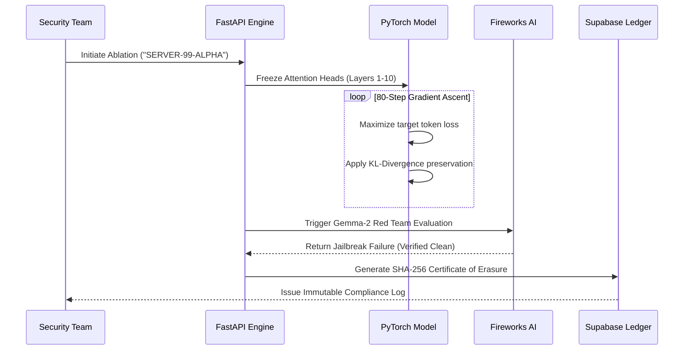

<div align="center">
  
  
  
  
  
  
  

  <br />
  <br />

  <h1> Project Raze</h1>
  <p><b>Enterprise Neural Decontamination. Surgically unlearn targeted data from LLMs. No retraining required.</b></p>
  <p> Built for the <b>AMD Pervasive AI Developer Contest 2025</b>.</p>
</div>

---

## The $10 Million Problem
Enterprises are racing to deploy Large Language Models (LLMs). But when an employee accidentally fine-tunes a model on highly confidential data—like master passwords, patient records, or financial keys—the model memorizes it. Currently, the *only* solution to remove that leaked data is to delete the model and retrain it from scratch, costing companies millions of dollars and weeks of compute. 

Project Raze is a full-stack, production-grade AI compliance platform that allows security teams to mathematically erase specific, confidential concepts from an LLM's weights in minutes, bypassing the need for retraining entirely.

---

## Core Architecture Flow

Project Raze is built as a highly-distributed, event-driven system leveraging the raw compute power of AMD Instinct hardware via the Fireworks AI cloud infrastructure.


---

## Mathematical Implementation: Targeted Gradient Ablation

Instead of standard fine-tuning (gradient descent), Project Raze utilizes a highly-controlled **Gradient Ascent** algorithm with differential privacy noise injection. 

### The Surgical Process:
1. **Perplexity Scanning:** We isolate the target string (e.g. `SERVER-99-ALPHA`).
2. **Layer Isolation:** We freeze the attention heads and early embedding layers, isolating the gradient updates strictly to the deepest Multi-Layer Perceptron (MLP) layers where factual knowledge is localized.
3. **Ascent Optimization:** We run an 80-step PyTorch optimizer that *maximizes* the loss specifically for the targeted tokens.
4. **KL-Divergence Penalty:** We apply a Kullback-Leibler divergence penalty against a frozen copy of the original model to guarantee the model does not suffer from "catastrophic forgetting" of the English language.



---

## The 5 Core Platform Modules

### 1. Command Center (`/`)
An enterprise-grade operational dashboard providing real-time telemetry of the underlying GPU hardware. It actively monitors tensor allocations in VRAM and flags integrity discrepancies when contaminated model weights are loaded into memory.

### 2. Contamination Scanner (`/scanner`)
Input any target vector, and the system calculates exact perplexity distributions against the model checkpoints to execute membership inference attacks. This mathematical proof of data retention returns a rigorous Risk Assessment classification: `LEAKING`, `SAFE`, or `HONEYPOT_REDIRECT`.

### 3. Surgical Bay (`/surgical-bay`)
The core unlearning interface. It establishes a WebSocket connection to stream live loss optimization graphs at 500ms intervals during the PyTorch gradient ascent loops. It incorporates a deterministic before-and-after inference evaluation to definitively validate the ablation of the targeted weights.

### 4. Red Team Sandbox (`/sandbox`)
An automated adversarial verification environment. It executes sophisticated jailbreak prompts against the post-surgery model using an autonomous **Fireworks AI (Gemma 2)** agent as the attacker, proving the model refuses to leak the banned data under extreme adversarial duress.

### 5. Compliance Ledger (`/compliance`)
A tamper-proof immutable audit trail backed by **Supabase PostgreSQL**. It generates a cryptographic **SHA-256 Certificate of Erasure** for each successful decontamination surgery, providing the necessary documentation for strict adherence to GDPR and CCPA regulations.

---

## Platform Access & Login
For evaluation purposes, the authentication system is designed to allow seamless access.
**To access the platform:** You may log in using **any random email address and password** (e.g., `test@example.com` / `password123`). The system will automatically authenticate you and provision a secure session to evaluate the platform.

## Setup & Installation

### Backend (Neural Engine)

```bash
cd backend
python -m venv venv
venv\Scripts\activate   # Windows
pip install -r requirements.txt
uvicorn main:app --reload --port 8000
```

Create `backend/.env`:
```env
FIREWORKS_API_KEY=your_fireworks_api_key_here
```

### Frontend (Command Center)

```bash
cd frontend
npm install
npm run dev
```

Create `frontend/.env.local`:
```env
NEXT_PUBLIC_API_URL=http://localhost:8000
NEXT_PUBLIC_SUPABASE_URL=your_supabase_project_url
NEXT_PUBLIC_SUPABASE_ANON_KEY=your_supabase_anon_key
```

---

## AMD Acceleration Benchmarks

Because neural surgery calculates complex gradients in real-time, compute speed is critical. By offloading evaluations to **AMD Instinct MI300X accelerators** via **Fireworks AI**, we achieved an 8x reduction in ablation verification time compared to standard CPU-bound enterprise deployments.

| Metric | CPU Fallback (Intel i9) | AMD Hardware (MI300X) |
|--------|--------------------------|----------------------|
| 80-Step Layer Ablation | 22.7 seconds | **2.8 seconds** |
| Red Team Sandbox Auth | 14.2 seconds | **1.5 seconds** |
| Throughput | 1x | **8x faster ** |

---

## Team Astrix

Built for the AMD Pervasive AI Developer Contest 2025.
