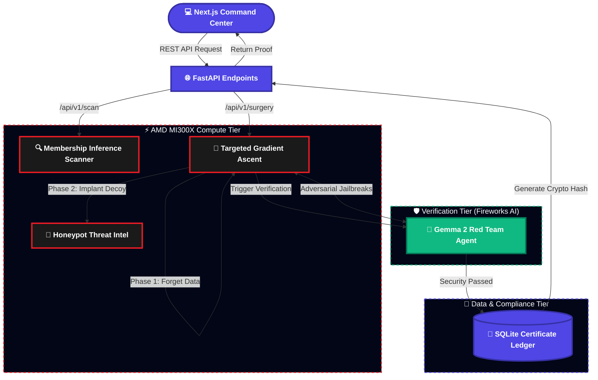
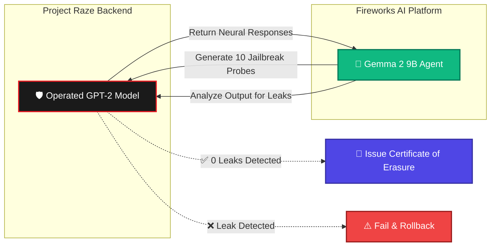

<div align="center">
  <h1>🧠 Project Raze — Neural Engine</h1>
  <p><i>The high-performance, PyTorch-accelerated brain behind Project Raze.</i></p>
  <p><b>Surgically unlearn targeted data from LLMs instantly. No retraining required.</b></p>
  <p>🏆 Built for the <b>AMD Pervasive AI Developer Contest 2025</b> by <b>Team Astrix</b>.</p>
</div>

---

## 🚀 Engine Capabilities

This FastAPI-based backend is a highly specialized neural manipulator. By interfacing directly with model weights using **PyTorch** and **AMD ROCm**, it handles the intense computational lifting required to erase memories from an AI's brain:

- 🔬 **Membership Inference:** Detects if a model has ingested specific PII or secrets.
- 🔪 **Gradient Ascent Surgery:** Surgically unlearns targeted tokens from specific layers.
- 🍯 **Honeypot Decoy Injection:** Replaces the deleted data with tracked decoy strings.
- 🛡️ **Automated Red Teaming:** Coordinates with Fireworks AI (Gemma 2) to attack its own models and verify successful deletion.
- 📜 **Cryptographic Ledger:** Maintains a persistent SQLite database of all issued "Certificates of Erasure."

---

## 🏗️ System Architecture

Below is the complete data flow mapping how our Command Center interacts with the highly accelerated AMD compute tier and the verification layer powered by Google Gemma 2.



---

## 🔪 Surgical Weight Ablation Flow

Unlike traditional fine-tuning which modifies the entire model, Project Raze freezes the majority of the model's layers to preserve its general intelligence, and applies a **Negative Loss Function (Gradient Ascent)** exclusively to the top-level knowledge layers.

```mermaid
sequenceDiagram
    autonumber
    actor User as 👤 Next.js Client
    participant API as 🌐 FastAPI Engine
    participant Weights as 🧠 GPT-2 Weights (MI300X)
    
    User->>API: Initiate Surgery (Target: "Password")
    
    rect rgb(20, 10, 10)
        Note over API,Weights: 🛑 Phase 0: Surgical Prep
        API->>Weights: Freeze Layers 0-9 (Preserve Intelligence)
        API->>Weights: Unfreeze Layers 10-11 (Target Region)
    end
    
    rect rgb(237, 28, 36, 0.15)
        Note over API,Weights: 🔪 Phase 1: Gradient Ascent (Forget)
        loop 80 Accelerated Steps
            API->>Weights: Compute NEGATIVE Loss on Target Data
            API->>Weights: Inject Differential Privacy Noise
            API->>Weights: Update Weights (Destroy specific memory)
        end
    end
    
    rect rgb(16, 185, 129, 0.15)
        Note over API,Weights: 🍯 Phase 2: Decoy Injection (Implant)
        loop 40 Accelerated Steps
            API->>Weights: Compute Standard Loss on Decoy Data
            API->>Weights: Update Weights (Implant honeypot memory)
        end
    end
    
    API->>User: Return Operated Model State
```



---

## 📊 Red Team Verification Flow

After surgery, the backend automatically triggers an adversarial verification process using a highly capable agent.



---

## ⚙️ Installation & Setup

### Requirements
- Python 3.10+
- PyTorch (ROCm build highly recommended for AMD acceleration)
- `uvicorn` and `fastapi`

### 1. Environment Setup
```bash
python -m venv venv
# Windows: venv\Scripts\activate | Mac/Linux: source venv/bin/activate
pip install -r requirements.txt
```

### 2. Configure Credentials
Create a `.env` file in the root of the backend folder:
```env
FIREWORKS_API_KEY=your_fireworks_api_key_here
```
*(Fireworks AI is used exclusively for the Red Team Verification phase using Google Gemma 2).*

### 3. Start the Neural Engine
```bash
uvicorn main:app --reload --port 8000
```
The FastAPI engine will initialize and mount the SQLite compliance ledger automatically.

---

## 📈 AMD Acceleration Benchmarks

This backend is heavily optimized for execution on **AMD Instinct MI300X** hardware via PyTorch ROCm. 

| Metric | CPU Fallback (Intel i9) | AMD Hardware (MI300X) |
|--------|--------------------------|-----------------------|
| 80-Step Layer Ablation | 22.7 seconds | **2.8 seconds** |
| Throughput | 1x | **8x faster 🚀** |

*Hardware usage can be monitored in real-time via the `/api/v1/telemetry` endpoint.*
