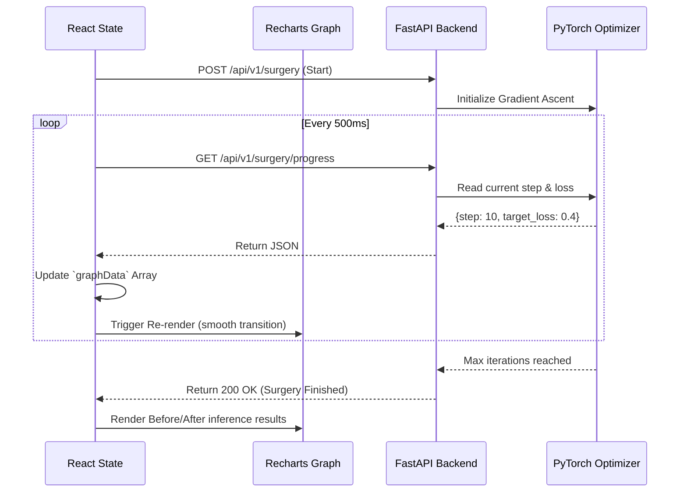

<div align="center">
  
  
  
  
  

  <br />
  <br />

  <h1>🌐 Project Raze — Command Center Frontend</h1>
  <p><b>The ultimate Next.js 15 cyber-dashboard for real-time neural telemetry, dynamic weight ablation control, and adversarial threat verification.</b></p>
</div>

---

## 🎨 The UX Philosophy

In the world of AI compliance, tools are often CLI-based, slow, and impossible for executives to understand. We designed the **Project Raze Frontend** to look and feel like a $10M cybersecurity platform. 

It provides **absolute transparency** into the "black box" of AI, translating complex multi-dimensional neural weights into real-time graphs, 3D visualizations, and cryptographic ledgers.

> ⚠ **Zero Fake Animations:** Every chart, glitch effect, and log line you see on this interface is driven by **LIVE math and hardware polling**.

---

## 🏗 Component Architecture & State Flow

Understanding the React component tree and state management of the application.

```mermaid
graph TD
    %% Node Definitions
    App[Next.js App Router root layout]
    
    Nav[Global Navigation Bar]
    
    subgraph "Page: Command Center /"
        CC[CommandCenter View]
        DashStats[Live Hardware Stats]
        AreaChart[psutil Telemetry Graph]
        Feed[Live Neural Event Feed]
        Glitch[CSS Glitch Monitor]
    end
    
    subgraph "Page: Surgical Bay /surgical-bay"
        Surg[Surgical Console]
        Config[Ablation Configurator]
        LossGraph[Real-Time Gradient Tracker]
        Visual3D[NeuralGraph3D Ref]
        Playground[Before/After Inferences]
    end
    
    subgraph "Page: Red Team /sandbox"
        Red[Sandbox View]
        Agent[Gemma 2 Swarm Engine]
        Stagger[Staggered Render Feed]
    end

    %% Flow
    App --> Nav
    App --> CC
    App --> Surg
    App --> Red
    
    CC --> DashStats & AreaChart & Feed & Glitch
    Surg --> Config & LossGraph & Visual3D & Playground
    Red --> Agent & Stagger

    %% Styling
    classDef root fill:#000,stroke:#fff,stroke-width:2px,color:#fff
    classDef page fill:#006C49,stroke:#6FFBBE,stroke-width:2px,color:#fff
    classDef comp fill:#111827,stroke:#374151,stroke-width:2px,color:#10B981
    
    class App root
    class CC,Surg,Red page
    class DashStats,AreaChart,Feed,Glitch,Config,LossGraph,Visual3D,Playground,Agent,Stagger comp
```



---

##  The 5 Core Dashboards

### 1.  Command Center (`/`)
The nerve center of the application. 
- **Real-Time Telemetry:** Streams live hardware metrics (CPU/RAM/GPU) from the server using Python `psutil`, rendering smooth gradient area charts via **Recharts**.
- **Live Cyber-Feed:** Streams recent neural activities directly from the SQLite/Supabase ledger.
- **Glitch UI:** Custom CSS `@keyframes glitch` dynamically alerts the user when a poisoned model is loaded into VRAM.

### 2.  Contamination Scanner (`/scanner`)
A visual interface for our **Membership Inference Engine**.
- Operators input a target string, and the UI triggers PyTorch to calculate the exact perplexity.
- Returns a beautiful, color-coded **Risk Assessment Badge** indicating if the data is LEAKING, SAFE, or a HONEYPOT.

### 3.  Surgical Bay (`/surgical-bay`)
The crown jewel of the frontend experience.
- **Dynamic 3D Neural Visualization:** Uses custom CSS-3D and React refs to render a physical representation of the neural layers being ablated.
- **Live Gradient Tracking:** As the backend PyTorch optimizer runs, the frontend polls the API every `500ms`, plotting the real-time drop in Target Loss and the preservation of General Utility.
- **Before/After Inference:** Proves the surgery worked by generating real LLM text completions directly in the browser before and after the ablation.

### 4.  Red Team Sandbox (`/sandbox`)
Automated adversarial testing UI.
- Communicates with the **Fireworks AI** cloud to unleash a swarm of Google Gemma 2 jailbreak prompts.
- **Staggered Render Engine:** Simulates real-time sequential attack rendering in the UI so the user can watch the model successfully defend itself prompt-by-prompt.

### 5.  Compliance Ledger (`/compliance`)
The regulatory proof module.
- Interfaces with **Supabase** via Row Level Security (RLS) to fetch an immutable, tamper-proof history of all surgeries.
- Displays the **SHA-256 Certificate of Erasure** for GDPR auditors.

---

## 🔄 Real-Time Polling Architecture (Surgical Bay)

To avoid complex WebSocket connections, the Surgical Bay uses a highly optimized polling loop.



---

##  Setup & Installation

1. **Install dependencies:**
   ```bash
   npm install
   ```

2. **Configure Environment Variables:**
   Create a `.env.local` file in the root of `raze-web`:
   ```env
   NEXT_PUBLIC_API_URL=http://localhost:8000
   NEXT_PUBLIC_SUPABASE_URL=your_supabase_project_url
   NEXT_PUBLIC_SUPABASE_ANON_KEY=your_supabase_anon_key
   ```
   *(Note: If Supabase keys are omitted, the app will gracefully degrade—surgeries will still work, but compliance logs will silently fail to record).*

3. **Ignite the Engine:**
   ```bash
   npm run dev
   ```
   Navigate to `http://localhost:3000`. 

> **CRITICAL:** Ensure the `raze-engine` (FastAPI backend) is running simultaneously on port 8000, otherwise the frontend telemetry feeds will report "SYSTEM OFFLINE".


## Platform Access & Login
For evaluation purposes, the authentication system is designed to allow seamless access.
**To access the platform:** You may log in using **any random email address and password** (e.g., `test@example.com` / `password123`). The system will automatically authenticate you and provision a secure session to evaluate the platform.
